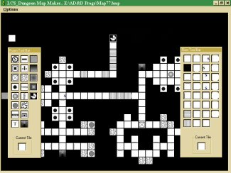



## AD&D BitBlt Map Designer

### Description

Shows howto make floating toolbars + using the BitBlt API Calls to make & save your AD&D maps to bmp files.
 
### More Info
 
BitBlt API.

User must know alittle of BitBlt

A "Pick & plop" style of map maker.

None, works with 95*98 vb5 & vb6.

             |
---                |---
**Submitted On**   |2000-03-30 19:50:08
**By**             |[LordCallubonn](https://github.com/Planet-Source-Code/PSCIndex/blob/master/ByAuthor/lordcallubonn.md)
**Level**          |Intermediate
**User Rating**    |4.5 (18 globes from 4 users)
**Compatibility**  |VB 5\.0, VB 6\.0
**Category**       |[Games](https://github.com/Planet-Source-Code/PSCIndex/blob/master/ByCategory/games__1-38.md)
**World**          |[Visual Basic](https://github.com/Planet-Source-Code/PSCIndex/blob/master/ByWorld/visual-basic.md)
**Archive File**   |[CODE\_UPLOAD138191152001\.zip](https://github.com/Planet-Source-Code/lordcallubonn-ad-d-bitblt-map-designer__1-14451/archive/master.zip)

### API Declarations

BitBlt

